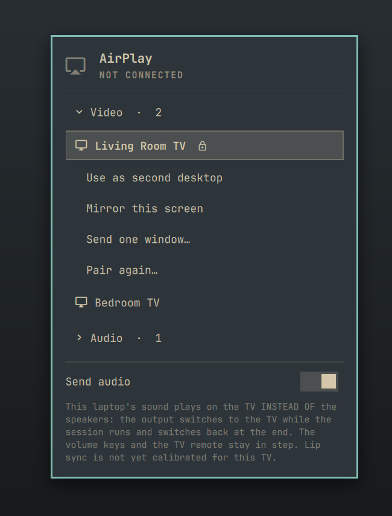
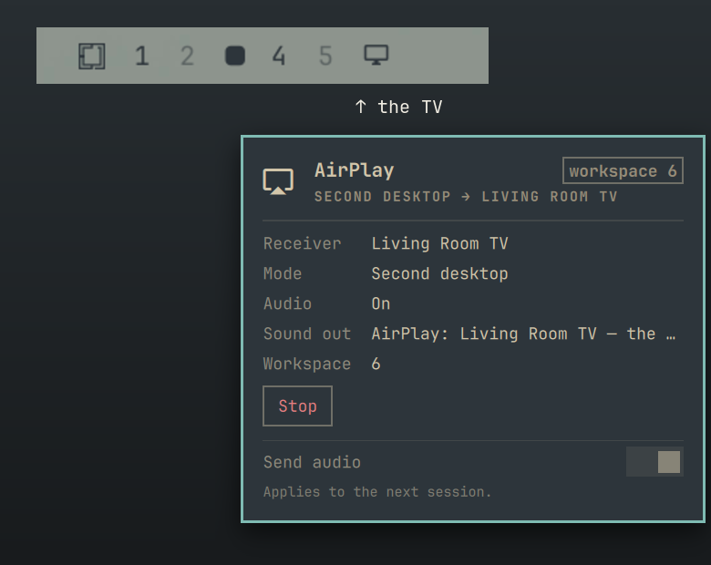
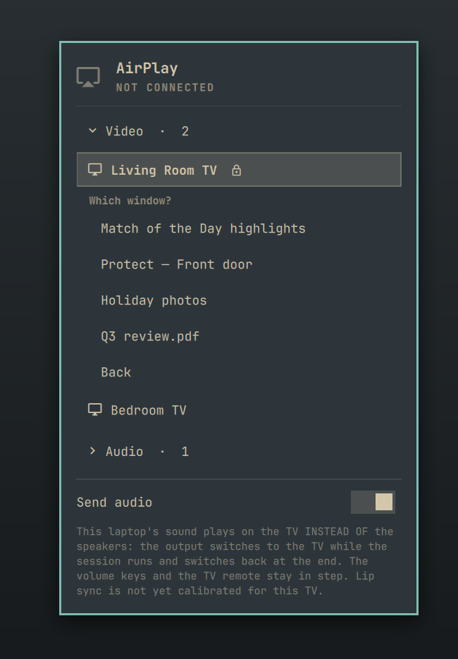
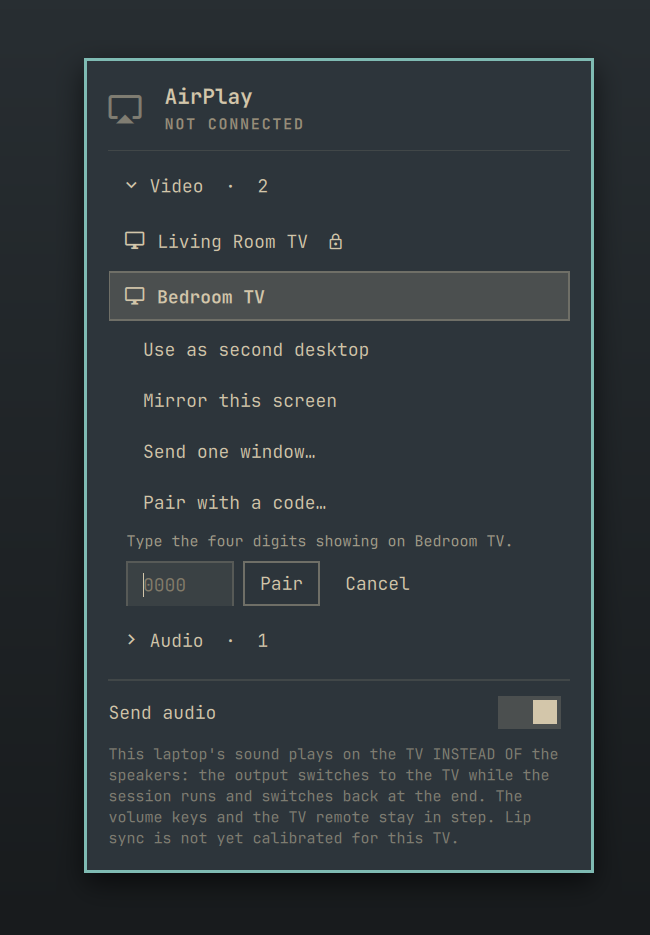

# omarchy-cast

The AirPlay menu for Omarchy's bar: click the AirPlay icon, pick a TV, pick
how to use it.


## What you get

You know the AirPlay menu on a Mac? Click it, pick the TV, and your screen's up
on the wall. This brings that to Omarchy. It isn't a wrapper around somebody
else's tool. It's a sender written from scratch in Rust for Wayland and
Hyprland, tested against a real TV, and built to be fast and stay out of your
way.

**Pick a TV right from the bar.** Your TVs show up in the AirPlay menu. Click
one, then choose what it should show.



**Use the TV as a second desktop.** This is the one you'll use most. The TV
gets its own workspace, and it turns up as a little TV icon at the end of your
workspace bar. Click it to hop over, drag a window across, and keep working on
the laptop while the TV plays.



**Or send just one window.** A video, a camera feed, your slides: the rest of
your screen stays yours.



**Or mirror the whole screen** when everyone needs to see what you see.

**Sound comes too.** Turn on *Send audio* and your laptop's sound moves over to
the TV, the way a Mac hands it over. The TV's volume follows your volume keys,
and your speakers come back when you stop.

**Pair once.** Some TVs ask for a code the first time. Type the four digits
from the TV and you're set.



**It's quick.** The picture never leaves the GPU: it goes straight from the
screen into the hardware video encoder. That's about 5 ms from a frame being
drawn to it being ready to send, on around 7 % of one CPU core.
[The numbers, and how to check them on your machine.](https://github.com/jonspinks/omarchy-airplay#performance)

**It tidies up after itself.** Pairing keys stay private to your account,
every build is pinned to a tested commit, and the menu only ever stops or
cleans up things it started itself.

### What it works with

Tested end to end on a Samsung Frame, video and sound. Other AirPlay 2 TVs
should work but haven't been tried yet. An Apple TV won't: it needs Apple's
FairPlay, which this doesn't do. Speakers on their own (HomePod, Sonos) aren't
supported yet; sound goes to the TV along with the picture.

## The three pieces

AirPlay for Omarchy comes in three parts, and you want all three:

| Piece | What it does for you |
|-------|----------------------|
| [omarchy-airplay](https://github.com/jonspinks/omarchy-airplay) | **The sender.** Finds your TVs, pairs, and streams your screen, a window or a whole desktop, with sound. |
| [omarchy-cast](https://github.com/jonspinks/omarchy-cast) (`blacksheep.airplay`) | **The AirPlay menu** in your bar: pick a TV, pick a mode, pair, stop. |
| [omarchy-workspaces](https://github.com/jonspinks/omarchy-workspaces) (`blacksheep.workspaces`, listed as *Cast Workspaces*) | **The TV in your workspace bar**, so the second desktop is one click away. |

Omarchy plugins can't pull each other in, so you install each one yourself.
[omarchy-cast's README](https://github.com/jonspinks/omarchy-cast#install) walks
through all three in order.

## This piece: the AirPlay menu

Installs as the bar widget `blacksheep.airplay`. It lists the receivers on your
network, grouped into video and audio. Click one to see the three modes. Its
panel shows the live session: the receiver, the mode, where the sound is
playing, the TV's workspace, and one **Stop**. It handles pairing with the code
on the TV screen, and remembers **Send audio** for the next session. The work
itself is done by the sender, which this menu drives through `bin/airplay-ctl`.
Every session runs as a transient user unit, so a shell reload never orphans a
stream.

## Install

The sender goes on first — this widget is only its front end:

```bash
# 1. Build and install the sender (see omarchy-airplay for dependencies),
#    pinned to the commit this widget was tested against
git clone https://github.com/jonspinks/omarchy-airplay && git -C omarchy-airplay checkout --detach 3fe48d7095b1123c5ded00832722ba73fc3b0f70 && cargo build --release --manifest-path omarchy-airplay/Cargo.toml && install -Dm755 omarchy-airplay/target/release/airplay ~/.local/bin/airplay

# 2. Then the widget
omarchy plugin add https://github.com/jonspinks/omarchy-cast --enable

# 3. And the workspace indicator that marks the TV (replaces the stock one)
omarchy plugin add https://github.com/jonspinks/omarchy-workspaces --enable
omarchy plugin disable omarchy.workspaces

omarchy restart shell
```

Step 3 is separate because a plugin can't declare another plugin as a
dependency: `omarchy plugin add` installs exactly one. See
[The three pieces](#the-three-pieces) for what it adds.

The sender is pinned so that what you build is the commit this widget was
checked with, not whatever its branch holds today. Move the pin forward
deliberately, when a newer sender has been tried with this widget.

`omarchy restart shell` rather than a plugin reload: the bar icon is set at
construction, and a hot reload re-reads the code without re-creating the widget.

## Remove

Stop any session and put back an output a session left configured, then remove
the widget:

```bash
ctl=~/.config/omarchy/plugins/blacksheep.airplay/bin/airplay-ctl
"$ctl" stop; "$ctl" cleanup
omarchy plugin remove blacksheep.airplay
omarchy restart shell
```

To remove the sender and everything it and the widget keep:

```bash
rm -f ~/.local/bin/airplay
rm -rf ~/.config/airplay-rs          # receiver pairing keys
rm -rf ~/.local/state/airplay-rs     # audio handover claim
rm -rf ~/.local/state/blacksheep.airplay   # the "Send audio" preference
```

The widget does not edit your Omarchy, Hyprland or PipeWire configuration
files. The virtual display and the AirPlay audio output exist only while a
session runs; with **Send audio** on, the default output is switched to the TV
for the session and put back when it ends (or by `cleanup` above, if a session
was killed).

## What it does

The panel has two collapsible sections, **Video** and **Audio**. Opening one
scans the network and lists what it finds; clicking it again rolls it up. Only
one is open at a time, and an open list scrolls rather than growing the panel,
so a house full of speakers cannot push it off the screen.

Pick a television and it offers the three ways to use it:

- **Use as second desktop** — a new workspace that exists only on the TV. Drag
  a window there and it keeps playing while you work elsewhere.
- **Mirror this screen** — everything on the laptop panel.
- **Send one window…** — a single app, chosen from a list of open windows.
  It freezes if its workspace is hidden, so the second desktop is the better
  choice for something you want to watch.

While a session runs, the panel shows the receiver, the mode and (for a second
desktop) the workspace, with a single **Stop**. In the panel, `r` rescans and
`s` stops.

Receivers the sender cannot drive are shown but cannot be selected, with the
reason in the tooltip:

| Receiver | State |
|---|---|
| Samsung Frame (`LS*`) | works — proven end to end |
| Mac | selectable, marked untested |
| Apple TV | not supported — needs FairPlay, which the sender does not implement |
| Speakers (Sonos, HomePod, amps) | not yet — the sender sends audio only alongside video, to a TV |

The **Send audio** switch sends the laptop's system audio to the TV with the
picture (`airplay mirror ... --audio system`). It is **off by default** and
remembered across shell reloads (`bin/airplay-ctl audio-pref on|off`, stored in
`$XDG_STATE_HOME/blacksheep.airplay/audio`). It applies when a session starts;
while one runs the switch shows that session's audio and cannot be flipped.

With audio on the sound goes to the TV **instead of** the speakers, as on a
Mac: the sender publishes its own output named after the receiver (`AirPlay:
Demo TV`), the laptop switches to it, and the previous output comes back
when the session ends. The handover waits until the TV's volume has been set
from the laptop's, so the speakers keep playing right up to the moment the TV
starts making sound — and if that never happens the output is never taken.
The volume keys then drive the TV, and the TV remote moves that output's own
slider. While a session runs the panel shows **Sound out**: the TV's name once
the handover has happened, "the speakers, until the TV's volume is set" before
it, and a red line if the volume side failed or if you picked another output
yourself (which ends the sound for that session — restart it to get it back).

Heard on a Samsung Frame on 2026-09-21 and working: the laptop's level maps
to the TV (30% became -21 dB), the TV confirms it, and the sound follows about
three seconds later once that confirmation lands. Lip sync is not yet
calibrated, so the A/V offset still defaults to 0.

**Clean it up** also puts back an output that a killed session left configured
(`airplay audio --cleanup`; `airplay audio --status` says whether there is
anything to put back). The sink itself cannot be orphaned — the node dies with
its process — so the only rot is the remembered default.

## Pairing

Most receivers connect without a code. One that is set to ask shows four digits
on its own screen, and the panel offers **Pair with a code…** under a selected
receiver (**Pair again…** if it is already paired — a paired receiver carries a
key mark and connects silently, with nothing appearing on its screen).

The code belongs to the connection that asked for it. Submitting it from a
second command makes the receiver issue a *new* number and refuse the one you
just read — measured on a Frame, which showed one code (say 1234) and then rejected it. So
the sender holds one socket open across the whole exchange: ask, wait for a
human, answer on that same connection. `bin/airplay-ctl` owns that process:

```
bin/airplay-ctl pair-start <host>          # ask; holds the connection open
bin/airplay-ctl pair-code  <host> <code>   # answer on that same connection
bin/airplay-ctl pair-cancel <host>         # give up without spending an attempt
```

Cancelling matters: giving up closes the input before a proof is built, so it
does not spend one of the receiver's few allowed attempts. A wrong code ends the
run and the receiver shows a new number, so the panel asks you to request
another rather than retyping.

Ending a pairing only ever signals the one `pair-start` launched. It runs under
`setsid` as its own process group, and `pair-start` records the group leader's
pid and start time. Cancel and cleanup signal that group only if its leader is
still that same process, so a pairing started some other way, even to the same
receiver, is left alone.

Pairing straight after a session used to fail with *Connection reset by peer*:
a receiver that has just disconnected refuses the next pair-setup for a moment
while it tears the old session down. Measured on a Frame — reset immediately
after a session, accepted two seconds later. `pair-start` now retries
connection-level failures up to three times, which is free because the reset
happens before any code is submitted and so cannot spend one of the receiver's
few allowed attempts. Expect the first attempt after a session to take around
twenty seconds; the panel says "Asking … to show a code…" meanwhile.

## How it works

Everything goes through `bin/airplay-ctl`, which owns the JSON shapes and the
session lifecycle, so the QML stays simple and the behaviour can be tested
from a shell:

```
bin/airplay-ctl status | discover [timeout] | windows
bin/airplay-ctl start <host> screen|extend|window [target] [audio=on|off]
bin/airplay-ctl audio-pref [on|off]
bin/airplay-ctl stop | cleanup
```

A session runs as a transient systemd user unit, `blacksheep-airplay-session`,
rather than as a child of the shell. So a shell reload cannot orphan a stream,
only one session can run at a time, and **Stop** is a clean SIGTERM into the
sender's tested teardown. Logs: `journalctl --user -u blacksheep-airplay-session`.

The script only treats that unit as its own if it is transient and carries the
`AIRPLAY_PANEL_OWNER=blacksheep.airplay` marker that `start` sets. If some other
user service holds the name, the panel neither reports it as a session nor
stops it, and `start` refuses rather than fight it for the name.

The script takes `$AIRPLAY_BIN` if it is set and executable, then looks for
`airplay` on `PATH`, then `~/.local/bin/airplay`. Point `AIRPLAY_BIN` at
`target/release/airplay` to run against a build tree without installing it.

## Requirements

- The `airplay` binary from omarchy-airplay, built with `cargo build --release`.
- `systemd-run`, `hyprctl`, `python3`.

## Notes

- The bar icon is U+F001F (nf-md-airplay). Not the television glyph: the stock
  Display panel uses that one for a single screen.
- Icon changes and anything set at construction only take effect after
  `omarchy restart shell`; plugin hot-reload re-reads the code but does not
  re-create the widget.

## License

MIT — see [LICENSE](LICENSE).
